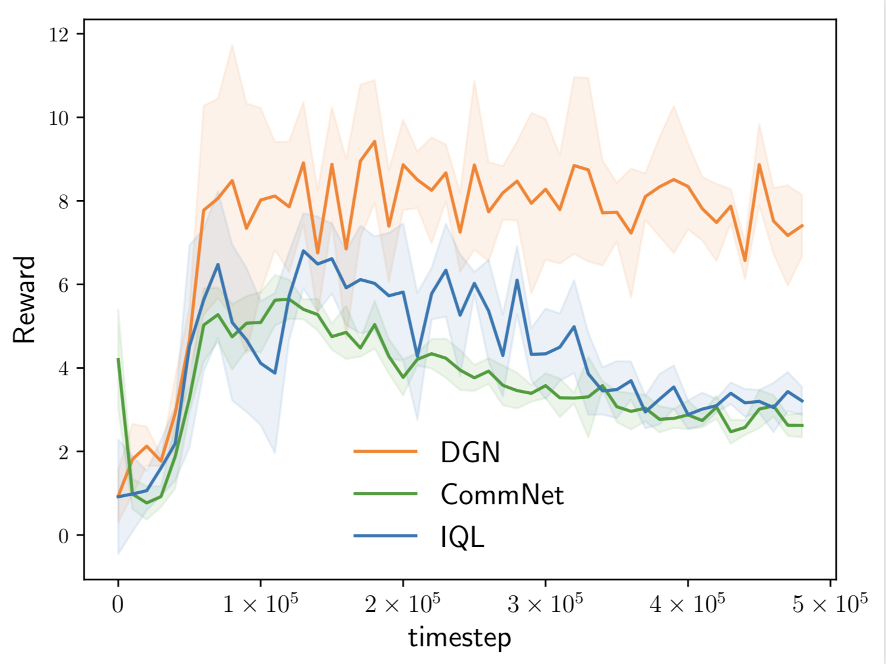
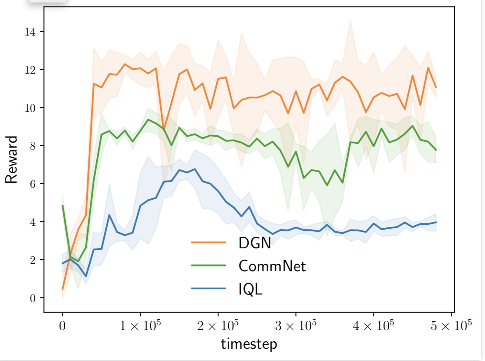
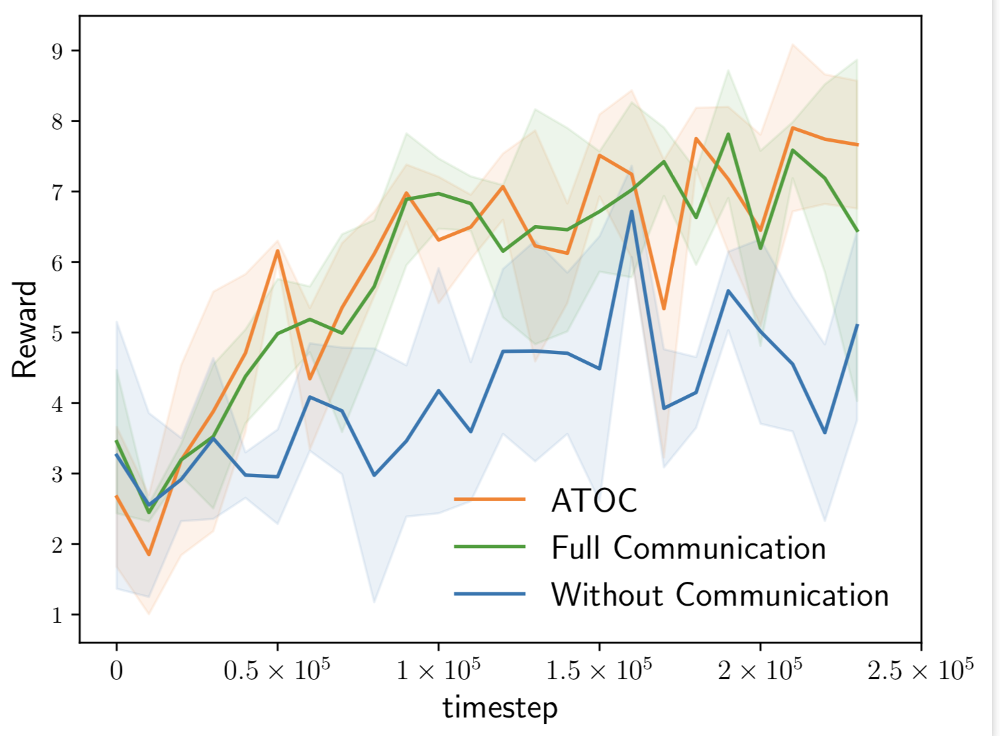
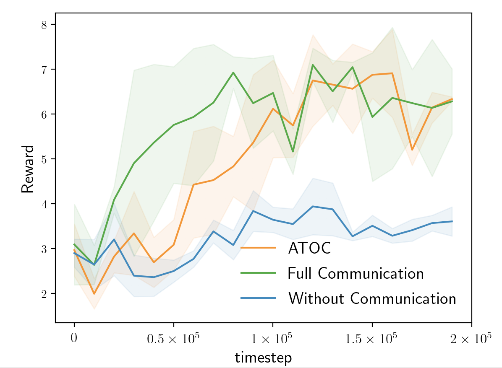

Due to the limitation of computing resource, the previous methods ATOC and DGN are tested on toy tasks. We provide more practical implementation of the two methods and perform them on SMAC tasks. To investigate the effectiveness of communication, we decrease the sight range (9) to make the original tasks more difficult. In 25m we set the sight range as 3 and 4, and in 10m_vs_11m, we set the  sight range as 4. In these tasks, agents could only communicate with the agents in its sight range (get_visibility_matrix() in SAMC).

## DGN

DGN could outperform CommNet and IQL.

 25m, sight range = 3 

'''

 25m, sight range = 4 

## ATOC

ATOC achieves similar performance as full communication, but could reduce ~15% communication cost. Since agents could only communicate with the agents in its sight range, full communication would not be negatively impacted by redundant information.

Update: Use full communication to compute the Q target and use attentional communication only in execution. This version could make the learning process more stable and reduce more than 50% communication cost while maintaining the performance.

 10m_vs_11m, sight range = 4 

'''

 25m, sight range = 5

