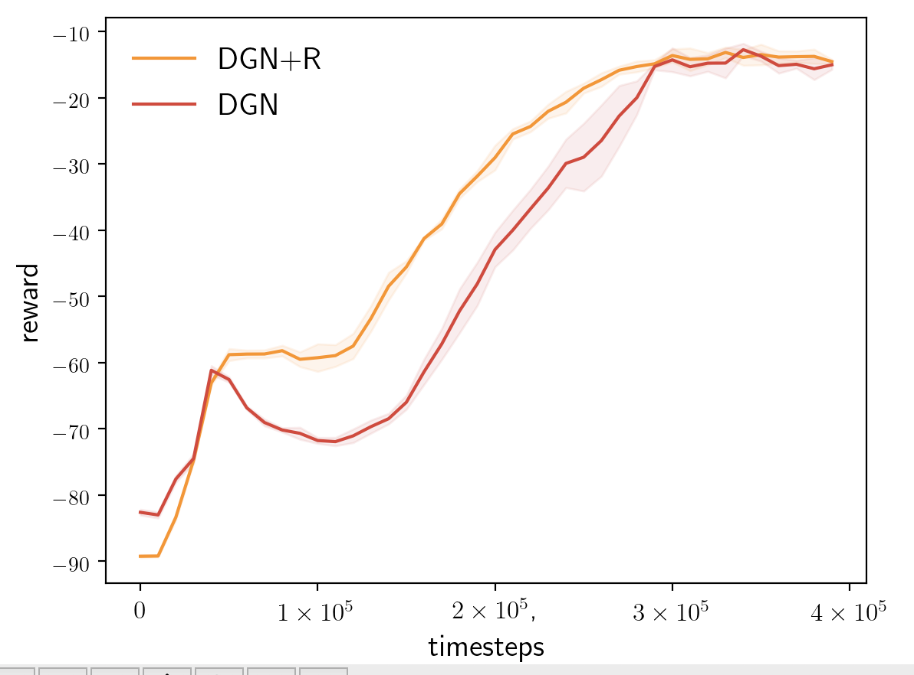
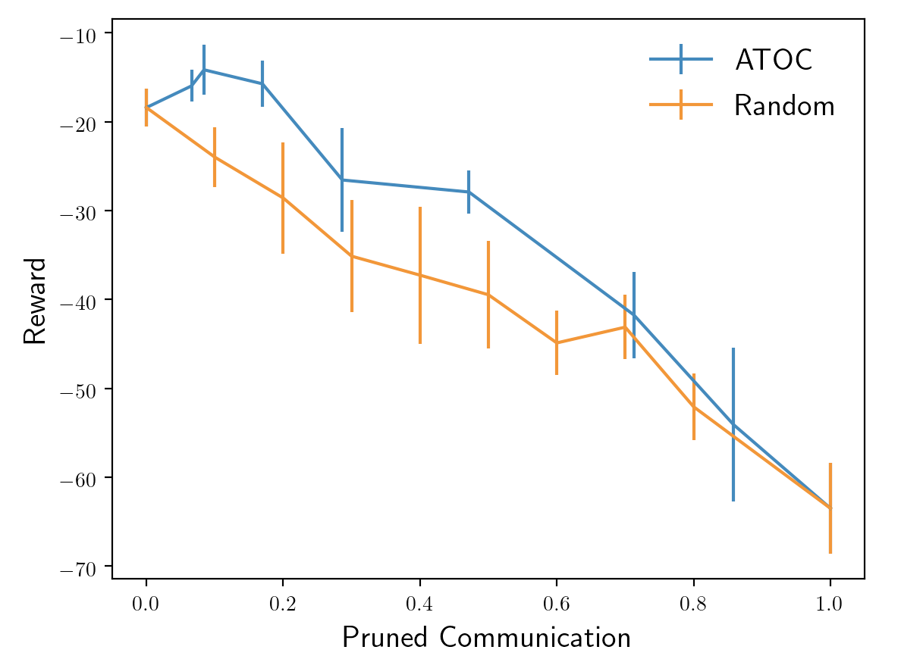
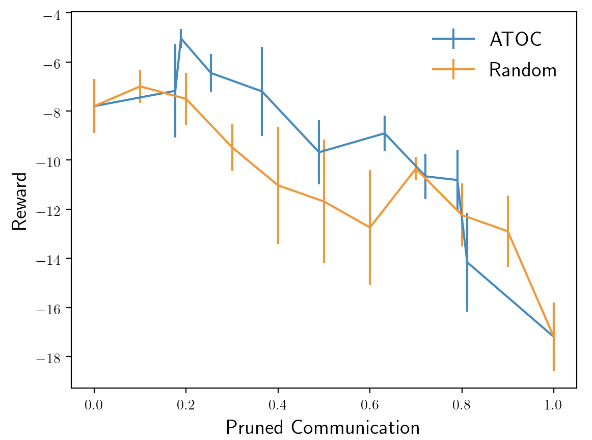

Update: We have fixed a small bug in surviving.py and modified some hyperparameters. The latest version is in DGN+ATOC.

## Results about DGN and baselines

| method | DGN             | Mean kernel     | IQL             | Full communication |
| ------ | --------------- | --------------- | --------------- | ------------------ |
| Reward | $-18.4 \pm 2.1$ | $-90.0 \pm 0.2$ | $-63.5 \pm 5.1$ | $-45.8 \pm 10.8$   |

Mean kernel averages the messages as the communication channel. DGN outperforms mean kernel, indicating that attention is more effective to integrate the communication messages. Full communication makes each agent communicate with all other agents, which  does not perform well, verifying the claim in ATOC that the redundant communication will negatively impact the performance.

## Results about graph regularization

Graph regularization could help the consistency of cooperation by focusing on the agents which will stay in the communication range in the future step. We find the large coefficient of graph regularization could accelerate the learning. In the previous version, the performance of graph regularization is not significant because the coefficient is too small.

## Results about DGN+ATOC

obs_range = 1

obs_range = 2

ATOC could reduce the communication cost. When pruning the same communication, ATOC outperforms randomly pruning. If the obs_range becomes large (2), some communication is not necessary, thus pruning 20% ~ 40% communication could increase the performance.
